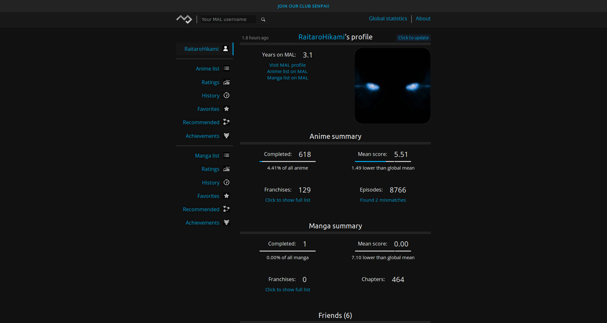
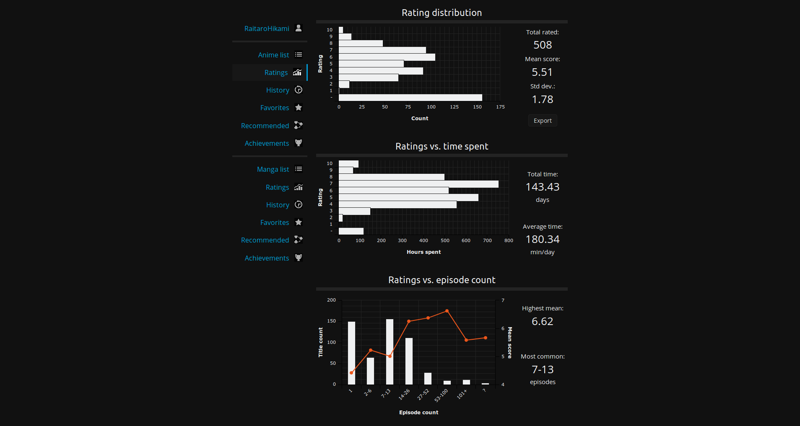
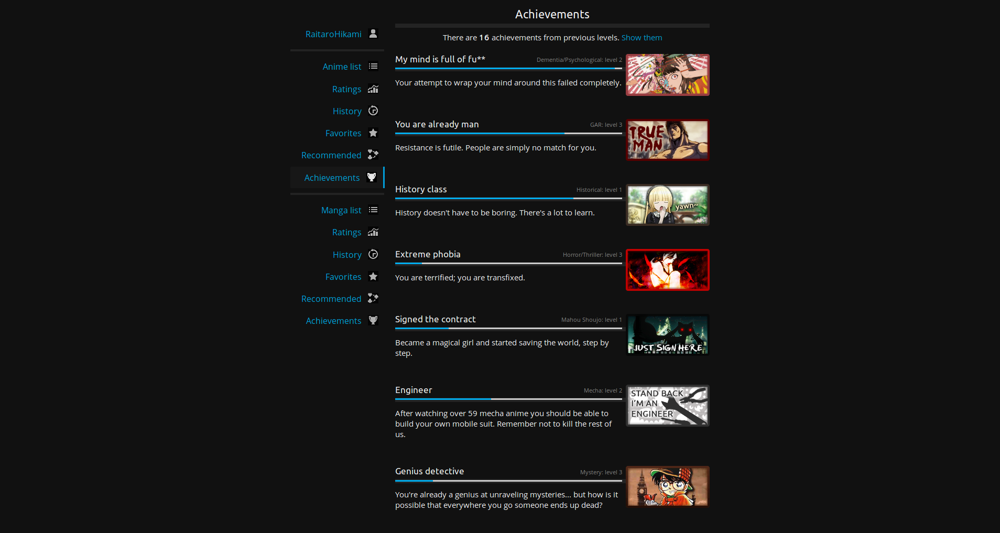
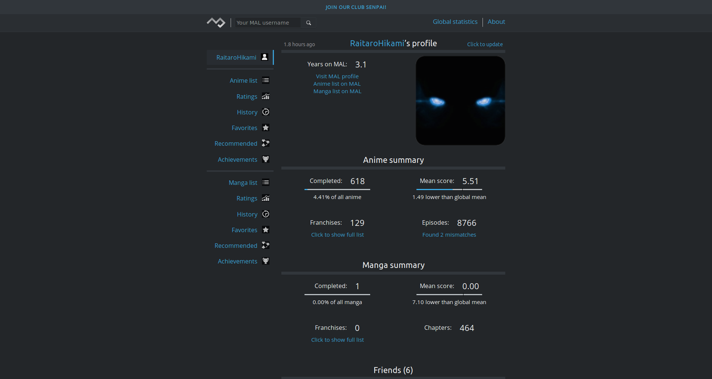

# MAL_AnimePlusGraph-DeepDark

Satisfy thy craving for anime and organization. May the dark be kinder on thine eyes. (MAL_AnimePlusGraph Dark Theme)

This is a dark theme for AnimePlusGraph inspired by [FT DeepDark](https://addons.mozilla.org/en-US/firefox/addon/ft-deepdark/?src=search). 

Also, credit where credit is due for the color palettes down bellow. ([@KDE](https://github.com/KDE), [@horst3180](https://github.com/horst3180), [@linuxmint](https://github.com/linuxmint), [Firefox](https://www.mozilla.org/en-US/firefox/new/), [YouTube](https://www.youtube.com/) and [Discord](https://discordapp.com/))

Theme as a userstyle [here](https://openusercss.org/theme/5a698cfab57fc10b000e1112).

### **You can also install all my themes at once from [here](https://gitlab.com/RaitaroH/Import-All-Deepdark).**

# Screenshots

# Colors 
The colors are available in the code; different colors can be used.

DeepDark:

BreezeDark:

